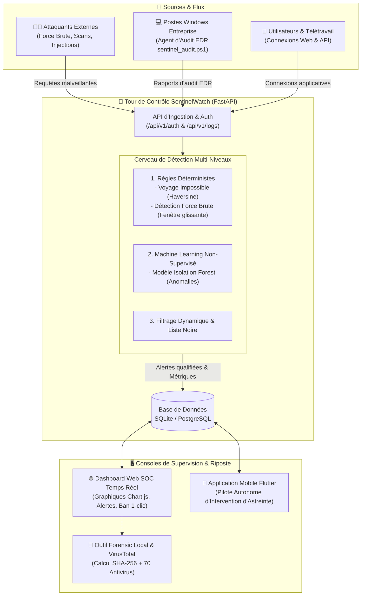

# 🛡️ SentinelWatch — Tour de Contrôle Sécurité, Détection d'Intrusions IA & EDR

> **SentinelWatch** est une tour de contrôle de sécurité complète (SIEM & EDR allégé) combinant détection d'intrusions par règles et Machine Learning, audit réel de posture Windows, boîte à outils forensic et console mobile d'intervention en direct.

---

## 🏛️ Architecture Globale du Système

---

## ✨ Fonctionnalités Majeures

### 1. 🧠 Moteur de Détection d'Intrusions Multi-Niveaux
* **Voyage Impossible (Haversine) :** Détecte l'usurpation de compte si deux connexions d'un même utilisateur sont distantes de plus de 150 km à une vitesse impossible (> 900 km/h).
* **Attaques par Force Brute :** Interception automatique de toute rafale d'échecs ($\ge 5$ tentatives en moins de 60s) avec géolocalisation de l'attaquant.
* **Détection d'Anomalies par IA (Isolation Forest) :** Analyse statistique non supervisée pour détecter les comportements inhabituels sans signature statique.

### 2. 💻 Agent d'Audit de Sécurité Endpoint (EDR Windows)
* **Score de Posture sur 100 :** Analyse complète du poste local Windows (Pare-feu Windows, Defender, durcissement RDP/NLA, détournements du fichier `HOSTS`, exécutables suspects dans `%TEMP%`).
* **Remédiation Immédiate :** Fournit les commandes précises pour corriger chaque faille identifiée.

### 3. 🔬 Boîte à Outils Forensic & VirusTotal
* **Calculateur SHA-256 en Local :** Analyse l'empreinte numérique via l'API Web Crypto sans jamais transférer les fichiers sur un serveur externe.
* **Corrélation VirusTotal :** Lien direct vers l'analyse officielle de réputation auprès de 70 moteurs antivirus mondiaux.

### 4. 📱 Console Mobile & Pilote Autonome (Flutter Android)
* **Intervention d'Astreinte :** Synchronisation temps réel des incidents de sécurité critiques.
* **Riposte en 1 Clic :** Validation immédiate du bannissement de l'IP attaquante directement depuis le smartphone.

---

## ⚡ Démarrage Rapide sur Windows (En 1 Clic)

Tous les outils essentiels sont automatisés via des scripts `.bat` à la racine :

| Fichier | Rôle & Action Immédiate |
| :--- | :--- |
| **`LANCER_SERVEUR.bat`** | Démarre l'API FastAPI et ouvre automatiquement le Dashboard Web (`http://localhost:8000/dashboard`). |
| **`AUTORISER_PORT_FIREWALL.bat`** | Configure le pare-feu Windows pour autoriser l'accès au smartphone ou aux autres PC sur le réseau. |
| **`LANCER_AUDIT.bat`** | Lance le scanner EDR de la machine Windows et envoie le rapport avec la note sur 100 au SOC. |
| **`COMPILER_NOUVEL_APK.bat`** | Compile l'application mobile Flutter et génère l'exécutable `SentinelWatch.apk`. |
| **`VERIFIER_FICHIER_VIRUSTOTAL.bat`** | Glissez n'importe quel fichier suspect dessus pour calculer son hash et vérifier VirusTotal. |

---

## 🎯 Limites Connues & Feuille de Route (Roadmap)

Par souci de rigueur d'ingénierie, les contraintes actuelles et les prochaines étapes de développement sont clairement identifiées :

* [ ] **Option 2 - Validation Terrain Mobile :** Finaliser les tests d'interconnexion en conditions réelles sur réseau cellulaire et Wi-Fi complexe (AP Isolation).
* [ ] **Option 3 - Déploiement Cloud Global :** Déployer SentinelWatch sur Google Cloud Run avec nom de domaine public et chiffrement TLS 1.3.
* [ ] **Ingestion Asynchrone :** Remplacer l'ingestion HTTP synchrone par un bus de messages distribué (Apache Kafka / Redis PubSub) pour supporter des millions d'EPS.
* [ ] **WebSockets & Notifications Push :** Remplacer le polling HTTP mobile par une liaison bidirectionnelle WebSocket et Firebase Cloud Messaging (FCM).
* [ ] **Agent Windows Persistant :** Transformer le script d'audit PowerShell en un service d'arrière-plan permanent avec interception des événements de sécurité Windows (Event ID 4625).

---

## 📄 Documentation Complète
Pour le protocole de tests réels sans simulateur et les démarches de déploiement en entreprise :  
👉 **Consultez le [`GUIDE_DEMARCHES.md`](./GUIDE_DEMARCHES.md)**

## 📜 Licence
Projet sous licence **MIT**. Libre d'utilisation pour des fins de recherche, de test et de démonstration académique ou professionnelle.
