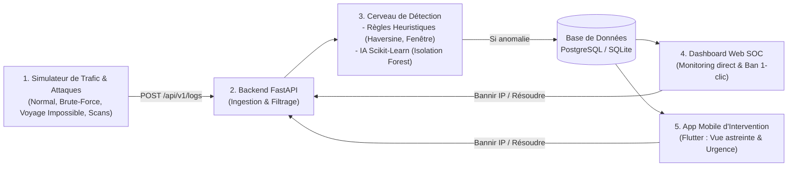

# 🛡️ SentinelWatch — Tour de Contrôle Sécurité & SIEM Allégé

> **Système complet de détection d'intrusions, supervision SOC en direct et intervention d'urgence mobile.**  
> Ingestion de logs, détection heuristique & Machine Learning (Isolation Forest), Dashboard Web SOC (React/Tailwind) et Application Mobile Flutter, déployable sur Google Cloud Platform (Cloud Run + Cloud SQL).

---

## 🏛️ Architecture & Flux Global



---

## 📁 Structure du Projet

```text
sentinel-watch/
├── backend/                  # API FastAPI & Cerveau de Détection
│   ├── app/
│   │   ├── api/              # Endpoints: auth, logs, alerts, audits, blacklist
│   │   ├── detection/        # Règles heuristiques + ML Isolation Forest
│   │   ├── models/           # Modèles SQLAlchemy (User, AccessLog, Alert, AuditReport)
│   │   ├── schemas/          # Validation Pydantic v2
│   │   └── static/           # Dashboard Web SOC autonome
│   ├── Dockerfile            # Image de production non-root sécurisée
│   ├── main.py               # Point d'entrée FastAPI
│   └── requirements.txt      # Dépendances
├── agent/                    # Agent d'Audit de Sécurité Réel Windows (PowerShell)
│   └── sentinel_audit.ps1    # Scanner EDR Posture Score & Remédiations
├── mobile/                   # Application Mobile Flutter (Auth, SOC, Pilote Autonome)
│   ├── lib/                  # Screens (Login, Home, AlertDetail, Blacklist)
│   └── pubspec.yaml
├── deploy/                   # Scripts de déploiement Google Cloud Platform
│   ├── deploy_gcp.ps1        # Script PowerShell automatisé
│   ├── deploy_gcp.sh         # Script Bash (Cloud Shell / Linux)
│   └── GCP_DEPLOYMENT_GUIDE.md
├── docker-compose.yml        # Orchestration locale FastAPI + PostgreSQL
└── README.md
```

---

## ⚡ Démarrage Rapide en Local

### 1. Démarrer le Backend
```powershell
cd backend
python main.py
```
- **Dashboard Web SOC** : [http://localhost:8000/dashboard](http://localhost:8000/dashboard)
- **Documentation API (Swagger)** : [http://localhost:8000/docs](http://localhost:8000/docs)

### 2. Lancer l'Audit Réel du Poste Windows
```powershell
cd agent
powershell -ExecutionPolicy Bypass -File .\sentinel_audit.ps1
```
> Le scanner analyse en direct l'antivirus Windows Defender, le pare-feu, les ports critiques et transmet le rapport au SOC.

---

## ☁️ Déploiement sur Google Cloud Platform (GCP)

Déploie l'intégralité du projet en une commande sur **Google Cloud Run** et **Cloud SQL** :

```powershell
cd deploy
.\deploy_gcp.ps1 -ProjectId "mon-projet-gcp" -Region "europe-west1"
```

Consulte le guide complet : [`deploy/GCP_DEPLOYMENT_GUIDE.md`](deploy/GCP_DEPLOYMENT_GUIDE.md).

---

## 🎯 Compétences Démontrées & Atouts Recruteur

- **Cybersécurité** : Détection d'intrusions spatiotemporelles (Haversine), Brute-Force, Fuzzing d'endpoints sensibles, Remédiation immédiate par liste noire dynamique.
- **Data & Intelligence Artificielle** : Pipeline d'extraction de caractéristiques et détection d'anomalies non supervisée via **Isolation Forest**.
- **Fullstack Web & Mobile** : Dashboard SOC temps réel et application mobile d'intervention rapide **Flutter**.
- **DevOps & Cloud GCP** : Conteneurisation Docker durcie (non-root), déploiement serverless Cloud Run, base managée Cloud SQL PostgreSQL et FinOps (autoscaling à zéro instance).
